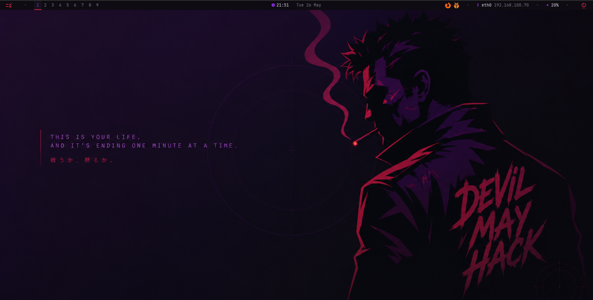
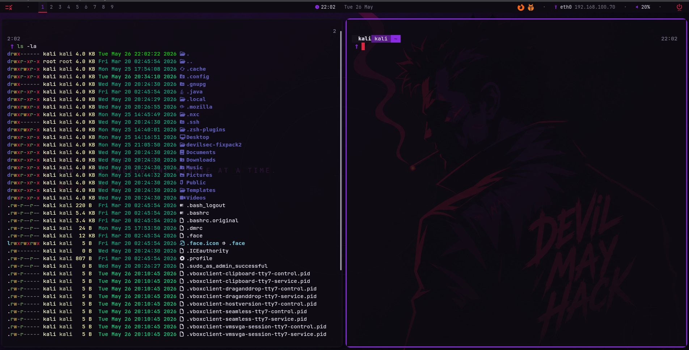
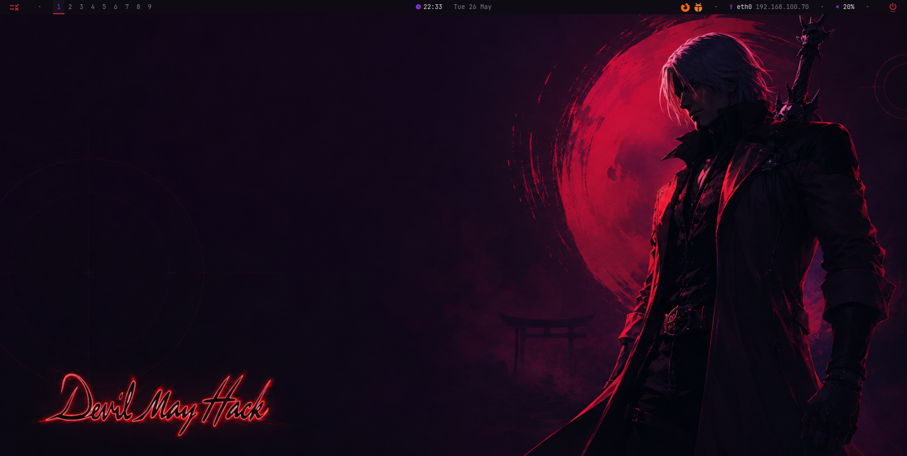
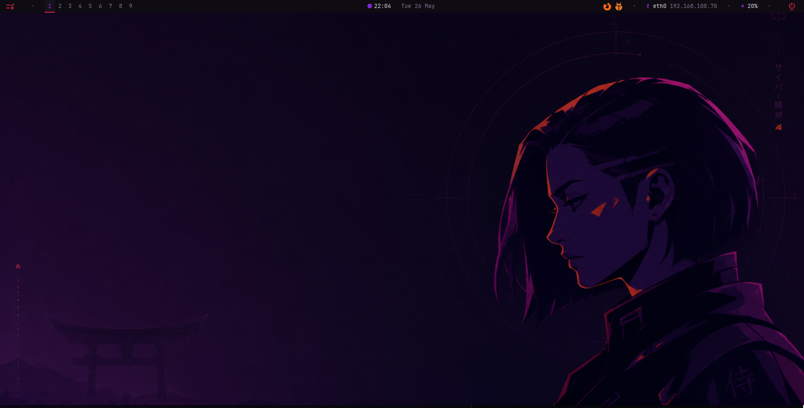
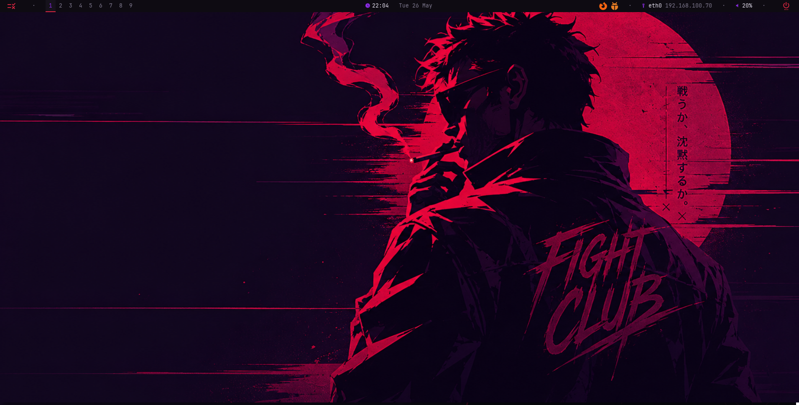
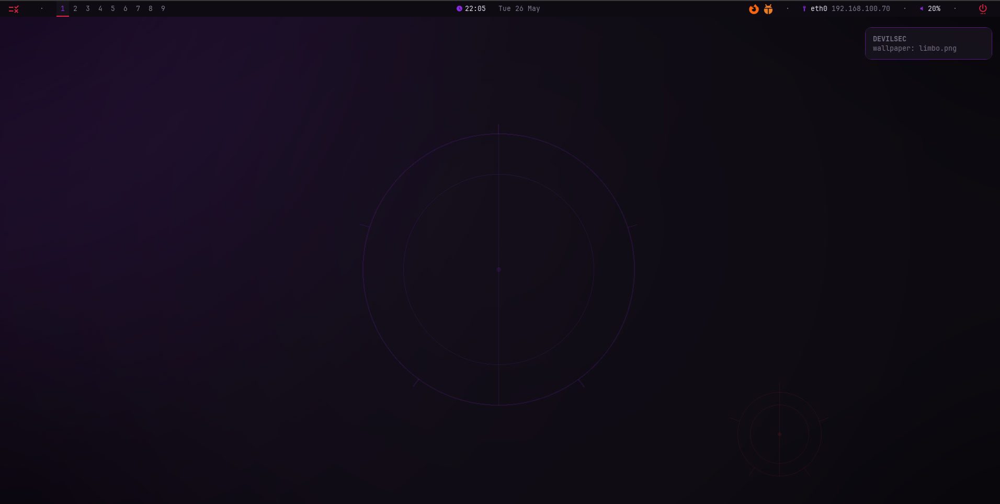

<div align="center">

# DEVILSEC Environment



<br>


### A custom offensive-security desktop environment for Kali Linux.

**bspwm · sxhkd · polybar · picom · kitty · rofi · zsh · styx · offensive arsenal**

> “Power, given by others, is never truly yours.”

</div>

---

## Overview

**DEVILSEC Environment** is a custom Kali Linux setup designed for offensive security, CTFs, Active Directory labs, web hacking, pivoting, recon and daily operator workflow.

It transforms a clean Kali installation into a fast, minimal, keyboard-driven and highly customized desktop based on **bspwm**, with a full hacker-style visual layer, custom wallpapers, terminal workflow, keybindings, helper scripts and a centralized control panel called **`styx`**.

This environment was built with a practical idea:

> Less clicking. More hacking.

---

## Preview








## Core Features

<div align="center">

| Window Manager | Terminal | Launcher | Bar | Shell | Control Center |
|---|---|---|---|---|---|
| `bspwm` | `kitty` | `rofi` | `polybar` | `zsh` | `styx` |

</div>

DEVILSEC is not just a rice. It is a complete Kali workflow for offensive security, CTFs and lab operations.

```text
bspwm + sxhkd + polybar + picom + kitty + rofi + zsh + styx
```

---

## Why DEVILSEC?

<table>
<tr>
<td width="50%">

### Command-driven workflow

Fast keyboard navigation, terminal-first actions, rofi menus and custom shortcuts designed for hackers who live inside the keyboard.

</td>
<td width="50%">

### Offensive-ready structure

Tools, wordlists, pivoting helpers, BloodHound CE, PEASS, scope handling and CTF workspace helpers are organized under a clean operator workflow.

</td>
</tr>
<tr>
<td width="50%">

### Visual control with `styx`

Change wallpapers, opacity, themes, polybar, brightness, gamma, scope and help panels from one centralized control center.

</td>
<td width="50%">

### Operator quality-of-life

Instant keyboard layout switcher, background-only terminal opacity, IP copy helpers, custom aliases and ready-to-use lab commands.

</td>
</tr>
</table>

---

## DEVILSEC Control Center

`styx` is the main command center of the environment.

```bash
styx
styx -g
styx -m wallpaper
styx -m opacity
styx -m theme
styx -m polybar
styx -m tools
styx -m scope
styx -m help
```

Shortcut:

```text
Super + Alt + S
```

Available modules:

| Module | Purpose |
|---|---|
| `wallpaper` | Change DEVILSEC wallpapers |
| `opacity` | Control kitty background opacity |
| `theme` | Switch visual themes |
| `polybar` | Change/reload bar variants |
| `scope` | Manage target scope/IP |
| `tools` | View offensive arsenal |
| `brightness` | Adjust screen brightness |
| `gamma` | Adjust color temperature |
| `font` | Adjust terminal font size |
| `help` | View quick help panel |

---

## Custom DEVILSEC Commands

### Visual workflow

| Command | Description |
|---|---|
| `styx` | Open DEVILSEC control center |
| `set-wallpaper` | Pick/apply wallpapers |
| `set-wallpaper --any` | Apply a random wallpaper |
| `devilsec-opacity 80` | Set kitty background opacity |
| `devilsec-opacity reset` | Restore default opacity |
| `devilsec-keyboard` | Open keyboard layout switcher |

### Offensive workflow

| Command | Description |
|---|---|
| `devilsec-arsenal` | Show installed offensive tools |
| `arsenal` | Alias for `devilsec-arsenal` |
| `adtools` | Show Active Directory tools |
| `pivoting` | Show pivoting tools |
| `mkt <name>` | Create a CTF/lab workspace |
| `extract-ports <scan.gnmap>` | Extract ports from nmap output |
| `wlfind <term>` | Search wordlists |
| `peas-serve` | Serve PEASS-ng payloads |
| `ligolo` | Ligolo helper wrapper |
| `bloodhound-ce` | Manage BloodHound CE stack |

### Network and scope

| Command | Description |
|---|---|
| `devilsec-copy-ip local` | Copy local IP |
| `devilsec-copy-ip vpn` | Copy VPN/tun IP |
| `devilsec-copy-ip target` | Copy current target IP |
| `styx -m scope` | Manage scope and target IP |
| `nmcli-scan-wifi` | Scan WiFi networks |
| `nmcli-wifi-info` | Show WiFi status |
| `nmcli-create-hotspot` | Create hotspot |
| `nmcli-restart-networking` | Restart networking |

---

## Keyboard Layout Switcher

Switch instantly between English and Latin American keyboard layouts.

```bash
devilsec-keyboard
devilsec-keyboard us
devilsec-keyboard latam
devilsec-keyboard show
```

Aliases:

```bash
kb
teclado
```

Shortcut:

```text
Super + Alt + K
```

| Mode | Layout |
|---|---|
| `us` | English US |
| `latam` | Latin America with dead tilde |
| `show` | Show current layout |

---

## Background-only Terminal Opacity

DEVILSEC uses kitty native background opacity instead of full-window transparency.

That means:

```text
transparent background
solid text
solid cursor
clean selection
no ghost text
```

```bash
devilsec-opacity show
devilsec-opacity 80
devilsec-opacity 100
devilsec-opacity reset
devilsec-opacity apply
styx -m opacity
```

Live controls:

| Shortcut | Action |
|---|---|
| `Ctrl + Shift + O` | Increase opacity |
| `Ctrl + Shift + I` | Decrease opacity |

---

## Offensive Arsenal

DEVILSEC organizes its tools under:

```text
/opt/devilsec/bin
/opt/devilsec/tools
/opt/devilsec/share
/opt/devilsec/wordlists
```

Everything in `/opt/devilsec/bin` is added to `$PATH`.

```bash
devilsec-arsenal
devilsec-arsenal --list
devilsec-arsenal --search ldap
devilsec-arsenal active-directory
devilsec-arsenal pivoting
devilsec-arsenal impacket
```

| Category | Tools |
|---|---|
| Active Directory | `nxc`, `bloodyAD`, `certipy`, `kerbrute`, `evil-winrm` |
| Impacket | `psexec.py`, `secretsdump.py`, `GetUserSPNs.py`, `ntlmrelayx.py` |
| Pivoting | `ligolo`, `ligolo-proxy`, `chisel` |
| Relay / Coercion | `coercer`, `mitm6`, `pretender`, `donpapi` |
| Recon / Web | `ffuf`, `gowitness`, `enum4linux-ng` |
| Post-Exploitation | `peas-serve`, `updog`, `shellpop` |

---

## Installation

Use it on a clean Kali Linux installation.

```bash
git clone https://github.com/xD4nt3/Kali-Autobspwm-DEVILSEC.git
cd Kali-Autobspwm-DEVILSEC
chmod +x install.sh
bash install.sh
```

Then reboot:

```bash
reboot
```

At login, select:

```text
bspwm
```

Do not run the installer as root:

```bash
bash install.sh
```

Not:

```bash
sudo bash install.sh
```

---

## Installer Flow

```text
00-preflight      System checks and update
10-base           Base packages, fonts and dependencies
20-wm             bspwm, sxhkd, picom, polybar, rofi, kitty
30-shell          zsh, starship and shell plugins
40-tools          Offensive toolchain
50-bloodhound     BloodHound CE
60-wordlists      SecLists, PayloadsAllTheThings and rockyou
70-dotfiles       Dotfiles, themes and wallpapers
80-styx           styx modules and helper commands
99-postflight     Final validation
```

Installer log:

```bash
cat .summon.log
```

---

## Project Structure

```text
Kali-Autobspwm-DEVILSEC/
├── install.sh
├── README.md
├── PATCHES-INTEGRATED.md
├── assets/
├── config/
│   ├── bspwm/
│   ├── sxhkd/
│   ├── polybar/
│   ├── picom/
│   ├── kitty/
│   ├── rofi/
│   ├── zsh/
│   └── starship.toml
├── core/
│   └── phases/
├── scripts/
│   ├── commands/
│   ├── system/
│   └── visual/
├── themes/
│   ├── polybar-themes/
│   ├── rofi-themes/
│   └── wallpapers/
└── tools-installer/
```

---

## Wallpapers

Source wallpapers:

```text
themes/wallpapers/
```

Installed wallpapers:

```text
~/Pictures/devilsec-wallpapers/
```

Current wallpaper pack:

```text
ascend.png
dante.png
dante_devilmayhack.png
devilmayhack.png
devilmayhack_clean.png
devilsec_japan.png
fightclub.png
inferno.png
limbo.png
purgatory.png
samurai.png
```

Recommended repo preview location:

```text
docs/images/wallpapers-grid.png
```

Example:

```md

```

---

## Lab Workspace Helper

Create clean CTF/lab workspaces with one command:

```bash
mkt fightclub
```

Output:

```text
fightclub/
├── nmap/
├── content/
├── exploits/
├── scripts/
├── loot/
└── screenshots/
```

---

## Wordlists

```bash
wlfind directory
wlfind raft -l
```

Main location:

```text
/opt/devilsec/wordlists/
```

Included:

```text
SecLists
PayloadsAllTheThings
rockyou.txt
```

---

## BloodHound CE

BloodHound CE can be managed directly from the terminal.

```bash
bloodhound-ce status
bloodhound-ce up
bloodhound-ce down
bloodhound-ce restart
bloodhound-ce logs
bloodhound-ce update
bloodhound-ce nuke
```

Default UI:

```text
http://localhost:8080/ui/login
```

---

## Keybindings

> `Super` = Windows key

<details>
<summary><b>Core shortcuts</b></summary>

| Shortcut | Action |
|---|---|
| `Super + Return` | Open kitty |
| `Super + Shift + Return` | Open floating kitty |
| `Super + D` | Rofi app launcher |
| `Super + Tab` | Rofi window switcher |
| `Super + R` | Rofi run prompt |
| `Super + Shift + P` | Power menu |
| `Super + Shift + S` | Scope manager |
| `Super + Escape` | Reload sxhkd |
| `Super + Shift + R` | Reload bspwm |
| `Super + Shift + Q` | Quit bspwm session |
| `Super + Ctrl + L` | Lock screen |
| `Super + Alt + S` | Open styx |
| `Super + Alt + K` | Keyboard layout switcher |

</details>

<details>
<summary><b>Kitty tabs from bspwm</b></summary>

| Shortcut | Action |
|---|---|
| `Super + Alt + T` | New kitty tab |
| `Super + Alt + W` | Close kitty tab |
| `Super + Alt + L` | Next kitty tab |
| `Super + Alt + H` | Previous kitty tab |
| `Super + Alt + N` | Rename kitty tab |
| `Super + Alt + Shift + L` | Move tab forward |
| `Super + Alt + Shift + H` | Move tab backward |

</details>

<details>
<summary><b>Window management</b></summary>

| Shortcut | Action |
|---|---|
| `Super + W` | Close window |
| `Super + Shift + W` | Kill window |
| `Super + S` | Toggle floating |
| `Super + F` | Toggle fullscreen |
| `Super + T` | Set tiled |
| `Super + M` | Cycle layout |
| `Super + Shift + B` | Balance bspwm tree |

</details>

<details>
<summary><b>Focus, move and resize</b></summary>

| Shortcut | Action |
|---|---|
| `Super + Arrows` | Focus window |
| `Super + Shift + Arrows` | Preselect direction |
| `Super + Shift + Space` | Cancel preselection |
| `Super + Alt + Arrows` | Resize window |
| `Super + Alt + Shift + Arrows` | Contract window |
| `Super + Ctrl + Arrows` | Move floating window |

</details>

<details>
<summary><b>Workspaces</b></summary>

| Shortcut | Action |
|---|---|
| `Super + 1..9` | Switch workspace |
| `Super + 0` | Switch workspace 10 |
| `Super + Shift + 1..9` | Send window to workspace |
| `Super + Shift + 0` | Send window to workspace 10 |
| `Super + Ctrl + 1..9` | Send window and follow |
| `Super + Ctrl + 0` | Send window to workspace 10 and follow |

</details>

<details>
<summary><b>IP helpers</b></summary>

| Shortcut | Action |
|---|---|
| `Super + Shift + F1` | Copy local IP |
| `Super + Shift + F2` | Copy VPN IP |
| `Super + Shift + F3` | Copy target IP |

</details>

<details>
<summary><b>Brightness, volume and temperature</b></summary>

| Shortcut | Action |
|---|---|
| `XF86MonBrightnessDown` | Brightness down |
| `XF86MonBrightnessUp` | Brightness up |
| `Super + F2` | Brightness down |
| `Super + F3` | Brightness up |
| `Super + F5` | Toggle mute |
| `Super + F6` | Volume down |
| `Super + F7` | Volume up |
| `Super + F8` | Toggle color temperature |
| `Super + F9` | Temperature down |
| `Super + F10` | Temperature up |

</details>

<details>
<summary><b>Screenshots and apps</b></summary>

| Shortcut | Action |
|---|---|
| `Print` | Flameshot region screenshot |
| `Super + Print` | Full screenshot |
| `Shift + Print` | Current screen screenshot |
| `Super + Shift + F` | Firefox |
| `Super + Shift + B` | Burp Suite |
| `Super + Shift + V` | VS Code |
| `Super + Shift + G` | Thunar |
| `Super + Shift + E` | Wireshark |
| `Super + Shift + A` | Postman |
| `Super + Shift + O` | Obsidian |

</details>

---

## Kitty Native Shortcuts

<details>
<summary><b>Terminal shortcuts</b></summary>

| Shortcut | Action |
|---|---|
| `Ctrl + Shift + T` | New tab in current directory |
| `Ctrl + Shift + W` | Close tab |
| `Ctrl + Shift + Q` | Close tab |
| `Ctrl + Shift + Right` | Next tab |
| `Ctrl + Shift + Left` | Previous tab |
| `Ctrl + Shift + Alt + T` | Rename tab |
| `Ctrl + Shift + Enter` | New split/window |
| `Ctrl + Shift + L` | Next kitty window |
| `Ctrl + Shift + H` | Previous kitty window |
| `Ctrl + Shift + +` | Increase font size |
| `Ctrl + Shift + -` | Decrease font size |
| `Ctrl + Shift + Backspace` | Reset font size |
| `Ctrl + Shift + O` | Increase opacity |
| `Ctrl + Shift + I` | Decrease opacity |
| `F1` | Copy to buffer A |
| `F2` | Paste from buffer A |
| `F3` | Copy to buffer B |
| `F4` | Paste from buffer B |

</details>

---

## Zsh Aliases

```bash
arsenal       # devilsec-arsenal
pivoting      # pivoting tools
adtools       # Active Directory tools
kb            # keyboard switcher
teclado       # keyboard switcher
cat           # bat without paging
catl          # bat with paging
catn          # bat with line numbers
myip          # show local IP
tunip         # show VPN IP
pyserve       # quick Python HTTP server
urlencode     # URL encode
urldecode     # URL decode
b64           # base64 encode
b64d          # base64 decode
ports         # extract ports
```

---

## Customization

| Task | Command |
|---|---|
| Change wallpaper | `styx -m wallpaper` |
| Random wallpaper | `set-wallpaper --any` |
| Change opacity | `styx -m opacity` |
| Change theme | `styx -m theme` |
| Change polybar | `styx -m polybar` |
| Change font size | `styx -m font` |
| Change brightness | `styx -m brightness` |
| Change gamma | `styx -m gamma` |
| Change keyboard | `devilsec-keyboard` |

Available themes:

```text
Limbo
Inferno
Purgatory
```

Available polybar variants:

```text
default
minimal
spectral
```

---

## Installed Locations

| Type | Path |
|---|---|
| bspwm config | `~/.config/bspwm/` |
| sxhkd config | `~/.config/sxhkd/` |
| polybar config | `~/.config/polybar/` |
| kitty config | `~/.config/kitty/` |
| rofi config | `~/.config/rofi/` |
| DEVILSEC binaries | `/opt/devilsec/bin/` |
| DEVILSEC tools | `/opt/devilsec/tools/` |
| DEVILSEC shared files | `/opt/devilsec/share/` |
| Wordlists | `/opt/devilsec/wordlists/` |
| Wallpapers | `~/Pictures/devilsec-wallpapers/` |
| Runtime state | `~/.config/devilsec/` |

---

## Recommended Screenshots

Upload your screenshots here:

```text
docs/images/
```

Suggested files:

```text
devilsec-preview.png
desktop-main.png
styx-panel.png
kitty-tabs.png
rofi-launcher.png
polybar.png
wallpapers-grid.png
```

Use them like this:

```md

```

---

## Troubleshooting

<details>
<summary><b>bspwm does not appear in login screen</b></summary>

```bash
ls /usr/share/xsessions/bspwm.desktop
bash install.sh
```

</details>

<details>
<summary><b>Shortcuts are not working</b></summary>

```bash
pkill -USR1 -x sxhkd
pgrep -a sxhkd
```

Shortcut:

```text
Super + Escape
```

</details>

<details>
<summary><b>Polybar is not showing</b></summary>

```bash
pkill -x polybar
~/.config/polybar/launch.sh
```

Or:

```bash
styx -m polybar
```

</details>

<details>
<summary><b>Transparency looks wrong</b></summary>

```bash
devilsec-opacity reset
devilsec-opacity 80
```

Then restart kitty.

</details>

<details>
<summary><b>Keyboard layout is wrong</b></summary>

```bash
devilsec-keyboard
devilsec-keyboard latam
devilsec-keyboard us
```

</details>

<details>
<summary><b>Wallpaper does not persist</b></summary>

```bash
set-wallpaper
cat ~/.config/devilsec/wallpaper.state
ls -la ~/.config/devilsec-wallpaper
```

</details>

<details>
<summary><b>ZIP extraction lost executable permissions</b></summary>

```bash
chmod +x install.sh
chmod +x core/phases/*.sh
chmod +x scripts/system/*
chmod +x scripts/system/styx-modules/*.sh
chmod +x scripts/commands/*
chmod +x config/bspwm/bspwmrc
bash install.sh
```

</details>

---

## Ethical Use

DEVILSEC is built for authorized security work only:

```text
CTFs
labs
training
research
internal assessments
authorized pentesting
```

Do not use this environment against systems without explicit permission.

---

## Roadmap

```text
[ ] Installer profiles: minimal / full / CTF / enterprise
[ ] Wallpaper preview inside styx
[ ] VPN profile manager
[ ] Backup and restore manager
[ ] DEVILSEC update manager
[ ] Devil May Hack integration
[ ] One-command lab environment generator
```

---

<div align="center">

## DEVILSEC

```text
offensive workflow
minimal friction
maximum style
```

**Built for operators, CTF players and people who want their Kali to look as sharp as their methodology.**

</div>
